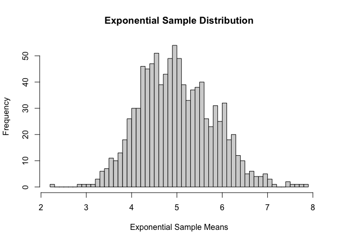

```r
library(ggplot2)
library(ggpubr)
```

## Overview
In this project I will investigate the exponential distribution in R and compare it with the Central Limit Theorem. I will simulate 1000 random samples with 40 random exponentials and compare the mean and variance of the samples with the theoretical statistics.

## Simulations
In the following code, I am creating 1000 samples of 40 random exponentials and putting them into a matrix 'x' so that there are 1000 rows each with 40 columns of random samples. Setting the seed to 188 so that the code can be reproduced.


```r
options(scipen=999)
set.seed(1888)
x<- matrix(rexp(40*1000, 0.2),ncol=40)
```

## Sample Mean versus Theoretical Mean
Let's first take a look at the distribution in a histogram with all 40,000 values included.


```r
hist(x,
     breaks = 40,
     xlab = "Exponential Sample",
     main = "Exponential Distribution",)
abline(v=mean(x))
```

<!-- -->

```r
mean(x)
```

```
## [1] 4.997758
```

In the above figure we can see that the data is not normally distributed, with the mean sitting at just below 5 (I have added in a line with the mean)

Let's compare this to the mean of the samples which as per the central limit theorem should be normally distributed.


```r
hist(rowMeans(x),
     breaks = 40,
     xlab = "Exponential Sample Means",
     main = "Exponential Sample Distribution",)
abline(v=mean(rowMeans(x)))
```

<!-- -->

```r
mean(rowMeans(x))
```

```
## [1] 4.997758
```

We can see the above figure appears to be normally distributed with a mean of 4.985 as well which is also close to the theoretical mean of 5 (1/lambda(0.2))

## Sample Variance versus Theoretical Variance:

Let's take a look at the standard devation x without taking into account the samples - we'll look at the standard deviation of the 40,000 values


```r
sd(x)
```

```
## [1] 5.019178
```

We can see that the standard deviation is close to the theoretical standard deviation of 5 (1/lambda(0.2))

Let's also take a look at mean standard deviation accross all the samples


```r
mean(apply(x,1,sd))
```

```
## [1] 4.894924
```

We can also see here that this is close to the theoretical standard deveation of 5

## Distribution:

We can use the Shapiro-Wilk test to also see if the sample means are normally distrubuted.


```r
shapiro.test(rowMeans(x))$p.value
```

```
## [1] 0.00007277564
```


```r
hist(rowMeans(x),
     breaks = 40,
     xlab = "Exponential Sample Means",
     main = "Exponential Sample Distribution",)
```

<!-- -->

We can see that the p-value is well below 5% we can conclude that the distrubution is normal when broken into samples of 40 rather than using the entire 40,000 samples together.

Our assumptions are that the set.seed() was set to 1888 and sampling method is exponential distribution using R's built in function rexp() with rate = 0.2
