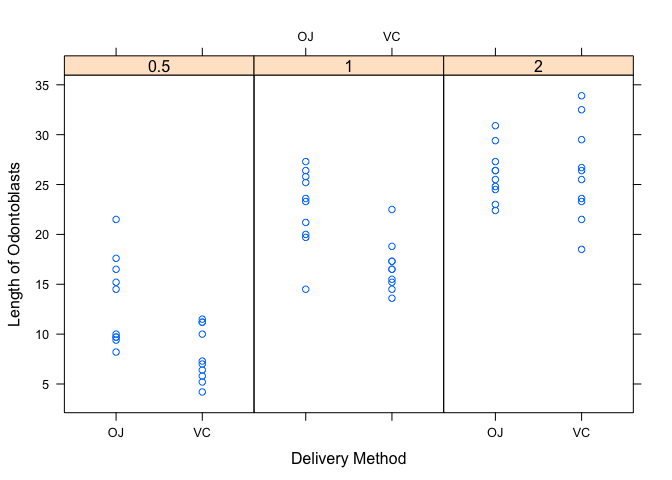

## Overview
Analysis of the ToothGrowth data set within the R package. We're going to perform some basic exploratory data analysis as well as using confidence intervals and/or hypothesis tests to compare tooth growth by supp and dose.


```r
options(scipen=999)
library(dplyr)
library(lattice)
```

## Loading and reviewing data

First, let's run a few commands to load the data and see how it is structured.


```r
data("ToothGrowth")
str(ToothGrowth)
```

```
## 'data.frame':	60 obs. of  3 variables:
##  $ len : num  4.2 11.5 7.3 5.8 6.4 10 11.2 11.2 5.2 7 ...
##  $ supp: Factor w/ 2 levels "OJ","VC": 2 2 2 2 2 2 2 2 2 2 ...
##  $ dose: num  0.5 0.5 0.5 0.5 0.5 0.5 0.5 0.5 0.5 0.5 ...
```

We can see that there are 60 observations of three variables, len, supp and dose. Let's also take a look at the summary of the data.


```r
summary(ToothGrowth)
```

```
##       len        supp         dose      
##  Min.   : 4.20   OJ:30   Min.   :0.500  
##  1st Qu.:13.07   VC:30   1st Qu.:0.500  
##  Median :19.25           Median :1.000  
##  Mean   :18.81           Mean   :1.167  
##  3rd Qu.:25.27           3rd Qu.:2.000  
##  Max.   :33.90           Max.   :2.000
```

The summary above along with the documentation of the data set in r using the function ?ToothGrowth gives us an overview of the data that we are looking at. Here's the description from the R documentation:

*"The response is the length of odontoblasts (cells responsible for tooth growth) in 60 guinea pigs. Each animal received one of three dose levels of vitamin C (0.5, 1, and 2 mg/day) by one of two delivery methods, orange juice or ascorbic acid (a form of vitamin C and coded as VC)."*

## Exploratory Analysis

Here is a plot of the data in a graph for us to get an idea of how the data looks:


```r
xyplot(len ~ supp | factor(dose),
       data = ToothGrowth,
       layout = c(3,1),
       xlab = "Delivery Method",
       ylab = "Length of Odontoblasts",
       labels = c(1,2,3)
       )
```

<!-- -->

The above plot shows us each dosage (0.5, 1, 2)  and each delivery method (OJ = Orange Juice, VC = Ascorbic Acid)

We can see from the plot that as the dosage increases, the tooth length increases as well. We can also see that for ascorbic acid the effect seems to be lower for 0.5 and 1.0 doses compared to the orange juice delivery method.

## Hypothesis testing 

In the next section we will run some tests to determine if the delivery method and dose has an effect on the length of odontoblasts within the sampled guinea pigs and the population as a whole.

### Does the delivery method have an effect?

For the first question, we will run a two-sided test H0:mu=m0 & H1:mu!=mu0 for each of the pairs of data (dose/delivery method)


```r
test_0.5_VC <- filter(ToothGrowth, dose == 0.5, supp == "VC")
test_0.5_OJ <- filter(ToothGrowth, dose == 0.5, supp == "OJ")
test_1.0_VC <- filter(ToothGrowth, dose == 1.0, supp == "VC")
test_1.0_OJ <- filter(ToothGrowth, dose == 1.0, supp == "OJ")
test_2.0_VC <- filter(ToothGrowth, dose == 2.0, supp == "VC")
test_2.0_OJ <- filter(ToothGrowth, dose == 2.0, supp == "OJ")

t.test(test_0.5_VC$len,
       test_0.5_OJ$len,
       alternative = "two.sided")
```

```
## 
## 	Welch Two Sample t-test
## 
## data:  test_0.5_VC$len and test_0.5_OJ$len
## t = -3.1697, df = 14.969, p-value = 0.006359
## alternative hypothesis: true difference in means is not equal to 0
## 95 percent confidence interval:
##  -8.780943 -1.719057
## sample estimates:
## mean of x mean of y 
##      7.98     13.23
```

```r
t.test(test_1.0_VC$len,
       test_1.0_OJ$len,
       alternative = "two.sided")
```

```
## 
## 	Welch Two Sample t-test
## 
## data:  test_1.0_VC$len and test_1.0_OJ$len
## t = -4.0328, df = 15.358, p-value = 0.001038
## alternative hypothesis: true difference in means is not equal to 0
## 95 percent confidence interval:
##  -9.057852 -2.802148
## sample estimates:
## mean of x mean of y 
##     16.77     22.70
```

```r
t.test(test_2.0_VC$len,
       test_2.0_OJ$len,
       alternative = "two.sided")
```

```
## 
## 	Welch Two Sample t-test
## 
## data:  test_2.0_VC$len and test_2.0_OJ$len
## t = 0.046136, df = 14.04, p-value = 0.9639
## alternative hypothesis: true difference in means is not equal to 0
## 95 percent confidence interval:
##  -3.63807  3.79807
## sample estimates:
## mean of x mean of y 
##     26.14     26.06
```

Using the t.test function with default confidence interval of 95% for a two sided test, we can see that for the doses of 0.5 and 1.0 the delivery method has a significant effect on the length of odontoblasts levels based on the p-values below 5%, so it appears that the OJ method is more effective for those doses. For the 2.0 dose we fail to rule out the null hypothesis that there is a difference.

### Does the dose size have an effect?

For the second question, we will run a one-sided test H0:mu=m0 & H1:mu>mu0 this time we will first test if there is a significant difference between the 0.5 and 1.0 dose


```r
test_0.5 <- filter(ToothGrowth, dose == 0.5)
test_1.0 <- filter(ToothGrowth, dose == 1.0)
test_2.0 <- filter(ToothGrowth, dose == 2.0)

t.test(test_0.5$len,
       test_1.0$len,
       alternative = "less")
```

```
## 
## 	Welch Two Sample t-test
## 
## data:  test_0.5$len and test_1.0$len
## t = -6.4766, df = 37.986, p-value = 0.00000006342
## alternative hypothesis: true difference in means is less than 0
## 95 percent confidence interval:
##       -Inf -6.753323
## sample estimates:
## mean of x mean of y 
##    10.605    19.735
```

We can see that with a very low p-value that we can reject the null hypothsesis for the difference in means between 0.5 and 1.0 doses. Let's also run the same test for the difference between 1.0 and 2.0 doses.


```r
t.test(test_1.0$len,
       test_2.0$len,
       alternative = "less")
```

```
## 
## 	Welch Two Sample t-test
## 
## data:  test_1.0$len and test_2.0$len
## t = -4.9005, df = 37.101, p-value = 0.000009532
## alternative hypothesis: true difference in means is less than 0
## 95 percent confidence interval:
##      -Inf -4.17387
## sample estimates:
## mean of x mean of y 
##    19.735    26.100
```

Here we can also see that as expected there is a significant difference between the 1.0 and 2.0 doses with a very small p-value as well.

## Conclusion

We can conclude that for smaller doses (0.5 & 1.0) we get improved results from the OJ delivery method. For the larger dose (2.0) there is no statistically significant difference. We can also conclude that we get improved results the higher the dose is. Assumptions made are that the sample is randomly selected from the population and is normally distributed.
